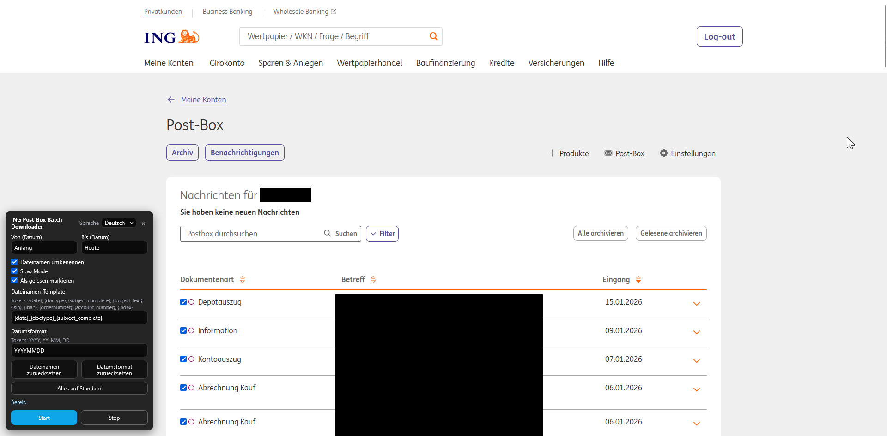
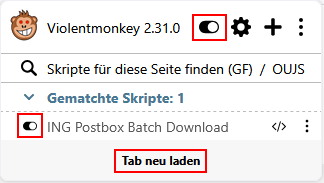

# Unofficial-ING-Documents-Batch-Downloader
This violentmonkey script for your browser enables a batch download for documents from https://banking.ing.de/app/postbox. This is an unofficial and private script. I am not affiliated with ING-DiBa in any way. 

## Violentmonkey
To use this script, you need the browser extentension [Violentmonkey](https://violentmonkey.github.io/). This extension allows the execution of user scripts.
Install the browser extension from the provided link.

## Scripts

Find the Violentmonkey extension on the addon section of your browser. Either as separate icon or inside the extension hub (the puzzle symbol). Open the Violentmonkey Dashboard.

To add a new script, click on the + button.

Select *New*,copy and paste the script code and hit *Save & Close*. Alternatively select *Install from URL* and paste the raw link to the file.

**Script:** [ING_document_batch_downloader.js](ING_document_batch_downloader.js)

**Raw File:** [ING_document_batch_downloader.js](https://raw.githubusercontent.com/Erzmaster/Unofficial-ING-Documents-Batch-Downloader/refs/heads/main/ING_document_batch_downloader.js)

After successful installation reload the page in question.

## Browser settings

In order for the script to successfully work, set "Datei speichern" ("Save file") for PDFs in the Browser settings (else it just opens a new tab for every PDF and does not download it automatically).

Also, please allow PopUps for the website ING.

## Usage in ING

The User Interface opens when navigating to [ING Postbox](https://banking.ing.de/app/postbox).
To use it, press start.

The script is active once accessing https://banking.ing.de/app/postbox. But you can turn it off during login or anytime you do not need it via the browser plugin. Make sure to hit tab reload ("Tab neu laden") via the browser plugin, so the changes become active.

